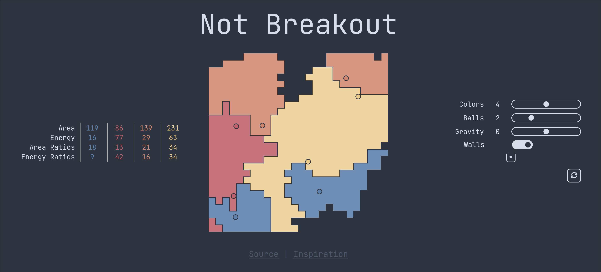

# Not Breakout



A simple web app to practice React, inspired by [Koen Van Gilst](https://pong-wars.vercel.app/). Consists of balls bouncing around and "breaking" blocks in the fashion of [breakout](https://en.wikipedia.org/wiki/Breakout_(video_game)), except instead of destorying the block each ball will set it to its own color, effectively "creating" it for all balls of a different color.

Includes a number of settings and statistics for playing around with.

This project uses [devenv.sh](https://devenv.sh) for development environment management.

### Prerequisites

1. Install devenv by following the [official installation guide](https://devenv.sh/getting-started/)
2. Clone and enter the repository:
```bash
git clone https://github.com/professional-username/exp-game-of-life
cd https://github.com/professional-username/exp-game-of-life
```
3. Initialize the development environment:
```bash
direnv allow
```

### Development
1. Run `project-run` to start up the development server
2. Open http://localhost:5173 in your browser

## License
This project is licensed under the GNU GENERAL PUBLIC LICENSE - see the [LICENSE](LICENSE) file for details.
